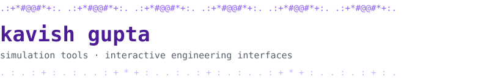

[LinkedIn](https://www.linkedin.com/in/kavish-gupta-2558b0309/) · [Email](mailto:kavishgupta06@gmail.com)

I'm a student who likes building software where the physics and the interface have to
agree with each other. Most recently I worked on a real-time digital twin for drone
engines, building the custom engine builder and the operator console.
I'm open to internships in software engineering, simulation, and front-end development.

python · javascript · three.js · html/css · timescaledb · git · github · claude code

**[UAV-EngineTwin](https://github.com/Arman0212/UAV-EngineTwin)** · python, three.js, timescaledb · *team project with [@Arman0212](https://github.com/Arman0212)*

A real-time digital twin for the piston engines in medium-altitude, long-endurance drones.
It compares live sensor data with a physics model to diagnose faults and predict how long
the engine can keep running.

What I built:
- **Custom engine builder.** Operators can define their own engine or pick from a library
  of nine ready-made engines, with efficiency solved separately for each one. I also fixed
  config loading so engine configs are actually applied.
- **Operator console.** I merged the cover page and console into one scroll-driven document
  with 22 chapters, made the scrolling smooth, added a skip-to-console control, and made
  the three.js 3D engine model selectable.
- **Correctness fixes.** I fixed a sandbox bug that was triggering the very false alarm the
  system exists to prevent, and corrected the evidence layer so it matches how the system
  actually works.
- **Docs and design.** I wrote the operator handbook and applied a unified violet/indigo
  palette across the site.

- Learning more about fault diagnosis and predictive maintenance
- Improving my front-end performance and 3D visualisation skills

---

*Some of my work is built with Claude Code as a pair programmer.*
